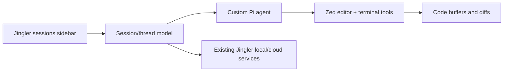

## Context
Jingler v2 should start from a Zed fork so the product feels like a code editor first, while preserving Jingler's session-centric workflow and custom Pi agent runtime. The initial outcome is a researched feature/architecture catalogue and a staged porting plan, not an immediate rewrite.

Current Jingler is an Electron/React monorepo. Product behavior is split across `apps/desktop`, `packages/ui`, `packages/core`, `packages/cli-adapters`, `packages/plugin-sdk`, and supporting cloud services. Zed is a Rust/GPUI editor and supports external agents through Agent Client Protocol (ACP), so a direct UI code port is unlikely; domain behavior and protocols are stronger reuse candidates.

> [!IMPORTANT]
> The first implementation milestone should prove Pi session hosting inside the Zed fork before broad feature migration. If that fails, the fork strategy should be reconsidered before more code is moved.

## Approach
1. Catalogue current Jingler features and locate each feature's UI, domain logic, persistence, process, and cloud dependencies.
2. Map those features to current Zed capabilities: reuse unchanged, customize existing Zed UI, bridge existing Jingler services, or rebuild.
3. Design the smallest viable integration for the custom Pi agent, testing ACP first while retaining Jingler-specific session semantics where ACP does not cover them.
4. Define a thin v2 vertical slice: session sidebar on the left, code editor in the center, Pi conversation/tool activity, terminal, diffs, and persisted session restoration.
5. Sequence later ports only after the vertical slice proves the fork and update strategy.

## Preliminary feature map
| Area | Current Jingler evidence | Likely Zed v2 treatment | Status |
| --- | --- | --- | --- |
| Project/workspace sessions | `README.md`, `apps/desktop` | Custom left sidebar and session model | To inspect |
| Custom Pi agent and Fleet | `apps/desktop/package.json`, `docs/subagent-fleet.md` | ACP feasibility spike plus Jingler-specific extensions | To inspect |
| Code/diff/tree/terminal | `packages/ui/package.json` | Prefer Zed-native editor, project panel, diff, and terminal | To verify |
| Plans/Plannotator | `README.md`, `packages/plannotator-ext` | Port behavior after core agent slice | To inspect |
| GitHub/PR workflows | `README.md`, `packages/cli-adapters` | Reuse services where possible; use Zed Git UI where sufficient | To inspect |
| Browser preview | `README.md`, `apps/desktop` | Compare with Zed web preview/extension support | To verify |
| Plugins, MCP, skills, themes | `README.md`, `packages/plugin-sdk` | Decide individually; avoid preserving two plugin systems by default | To inspect |
| Auth, devices, cloud, memory | `apps/server`, `apps/device-*`, `apps/memory-worker`, `packages/memory` | Keep existing services behind a Rust client/bridge initially | To inspect |

## Reuse
- Preserve existing backend and relay services unless the catalogue finds an Electron-only dependency.
- Reuse domain schemas and session data formats from `packages/core` and related packages where a process bridge is cheaper than a Rust rewrite.
- Prefer Zed's native editor, project panel, terminal, Git/diff, language tooling, settings, keymaps, and extension system over porting React equivalents.
- Evaluate Zed's official External Agents/ACP integration before inventing a custom agent protocol.

## Research and catalogue <!-- id: research-catalogue -->
Build an evidence-based matrix of Jingler features against current Zed capabilities and extension points.

### Approach
- Trace current features from renderer through IPC/services and persistence.
- Inspect the Zed source tree and official docs for UI customization, ACP, persistence, collaboration, Git, terminal, browser preview, extensions, licensing, and update mechanics.
- Classify each feature as keep, adapt, rebuild, defer, or drop.

- [ ] Inventory current user-facing features and their owning files/packages.
- [ ] Inventory reusable non-UI domain logic, protocols, and persisted data.
- [ ] Record Zed-native equivalents and gaps with source/doc links.
- [ ] Produce a migration matrix with effort, risk, and recommended phase.
- [ ] Confirm Zed licensing, trademark, distribution, and upstream-sync constraints.

### Acceptance
- [ ] Every README-level Jingler capability has an explicit disposition and evidence.
- [ ] Every proposed Zed reuse point links to current official docs or source.

### Files
- `PLAN.md` — M
- `docs/` — A (final architecture/feature catalogue location to choose)

> complexity: high

## Pi integration spike <!-- id: pi-spike -->
Prove that Jingler's custom Pi agent can run as a first-class Zed-hosted session without losing required controls.

### Approach
- Compare Pi's current event/tool/session contract with ACP's current protocol.
- Implement the least invasive route: an ACP adapter if it covers requirements; a narrow fork integration only for confirmed gaps.
- Exercise prompts, streaming, code edits, terminal calls, permissions, cancellation, restore, and one delegated-agent flow.

- [ ] Define the minimum Pi-to-Zed contract from current implementation evidence.
- [ ] Prototype one Pi session in a disposable Zed-fork branch.
- [ ] Document ACP gaps and any required Zed patches.
- [ ] Add runnable protocol/integration checks for the chosen route.

### Acceptance
- [ ] A Pi session can edit a file, run a command with approval, stream output, cancel, and restore after restart.
- [ ] The spike records whether Fleet/subagent events fit ACP or need a Jingler-specific channel.

### Files
- Zed fork paths — TBD after source inspection
- Existing Jingler Pi adapter paths — TBD after trace

> complexity: high
> depends: research-catalogue

## Editor-first vertical slice <!-- id: editor-slice -->
Ship the smallest useful Jingler-on-Zed experience: sessions at left, code at center, agent and terminal activity alongside it.

### Approach
- Add a Jingler session sidebar using Zed's existing panel/workspace patterns.
- Bind a selected session to project/worktree, editor state, Pi thread, terminal, and diff state.
- Reuse existing Jingler services through the narrowest maintainable process/API bridge.

- [ ] Add session list, grouping, selection, create, resume, and archive flows.
- [ ] Open the session's checkout/worktree in the Zed workspace.
- [ ] Host the Pi thread and expose tool activity, approvals, and cancellation.
- [ ] Persist and restore session-to-workspace state.
- [ ] Validate keyboard navigation and basic screen-reader labels.

### Acceptance
- [ ] A user can create or resume a session, ask Pi to change code, inspect the diff, run tests, and return after restart.
- [ ] Existing Zed editing, terminal, language, and Git workflows continue to work.

### Files
- Zed fork workspace/panel/agent paths — TBD
- Jingler bridge/service paths — TBD

> complexity: high
> depends: pi-spike

## Follow-on ports <!-- id: follow-on -->
Port only features that remain valuable once the editor-first slice is in daily use.

### Approach
- Order work from the migration matrix by user value and architectural risk.
- Keep Zed-native behavior when it meets the need; do not recreate Jingler's React UI for parity alone.

- [ ] Prioritize Plannotator, Fleet, PR/review, browser preview, devices/cloud, memory, MCP/skills, and plugin compatibility.
- [ ] Give each accepted feature its own commit-sized implementation plan and checks.
- [ ] Define upstream Zed sync and release/update operations before public distribution.

### Acceptance
- [ ] Each follow-on feature has a clear owner, dependency, migration route, and measurable acceptance check.
- [ ] Deferred and dropped features are explicit.

### Files
- TBD from approved migration matrix

> complexity: high
> depends: editor-slice

## Verification
- Current Jingler: focused unit/type checks for any bridge contracts plus existing `pnpm typecheck` and `pnpm test`.
- Zed fork: targeted Rust tests for modified crates, formatter/linter checks, and a clean Zed build.
- Manual: create, run, cancel, restore, diff, terminal, worktree, and delegated-agent flows on macOS first; platform scope remains an open decision.
- Operational: rehearse one upstream Zed merge and confirm Jingler patches remain small and isolated.

## Open decisions
- Whether v2 is a full product replacement, an experiment, or a separately shipped preview.
- Which platforms the first slice must support.
- Whether visual parity means Jingler's current styling inside Zed or Zed styling with Jingler's session layout.
- Which current features are mandatory for first release versus acceptable follow-ons.
- Whether ACP compatibility for other agents matters, or only the custom Pi agent is required.
