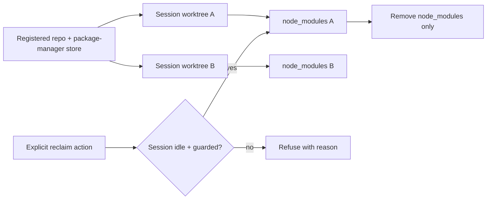

## Context
Jingler creates concurrent local coding sessions as Git linked worktrees under `~/jingler/worktrees`. A session can then acquire its own `node_modules`, so persistent sessions grow disk usage quickly.

The agreed requirements are:

- Sessions for one repository remain fully concurrent, including commands and uncommitted changes.
- Existing worktree sessions stay untouched and resumable until explicitly cleaned or deleted.
- The first release provides storage inventory plus manual cleanup. It does not auto-delete on a budget.

### Research result

A single ordinary checkout cannot meet full concurrency. One Git working tree has one `HEAD`, one index, and one set of tracked files; switching branches replaces that state. Linked worktrees are Git's supported mechanism for exposing several branches concurrently. Coding agents also require normal mutable filesystems and arbitrary shell access, so index-only branch editing isn't a viable replacement.

Worktrees already share Git object storage. The expensive parts are their checked-out files, dependency projections, build output, and caches. pnpm normally shares immutable package contents through its content-addressable store, but each project still has its own `node_modules` projection. This repository also uses `node-linker=hoisted` in `.npmrc` for Electron/native-module compatibility, making that projection larger.

> [!WARNING]
> Sharing one mutable `node_modules` symlink between branches is unsafe. Branches can have different lockfiles and manifests; workspace links can point into the wrong checkout; concurrent installs race on bins and metadata; native addons and lifecycle output can depend on cwd, Node/Electron ABI, OS, architecture, and branch source.

pnpm's Global Virtual Store is safer because pnpm keys shared projections by dependency graph, but it was introduced experimentally in pnpm 10.12.1. Jingler pins pnpm 10.7.0, the hoisted Electron/native setup needs compatibility testing, and the feature wouldn't solve npm, Yarn, Bun, or non-Node projects. It is not part of this change.

| Option | Concurrent | Branch-correct dependency state | Result |
| --- | ---: | ---: | --- |
| One checkout with branch switching | No | Only when serialized and clean | Rejected: conflicts with concurrency |
| One shared `node_modules` symlink | Superficially | No | Rejected: corruption/staleness risk |
| Copy-on-write container/FUSE overlays | Yes | Potentially | Rejected: platform and mount complexity |
| Worktrees + package-manager store | Yes | Yes | Keep as the safe baseline |
| Worktrees + manual cold dependency cleanup | Yes | Yes; reinstall needed after cleanup | **Selected** |

### Official references

- [Git worktree](https://git-scm.com/docs/git-worktree) — concurrent branches use multiple working trees.
- [Git repository layout](https://git-scm.com/docs/gitrepository-layout) — linked worktrees share repository data while retaining per-worktree state.
- [pnpm motivation](https://pnpm.io/10.x/motivation) — content-addressable package storage.
- [pnpm 10.x `node_modules` structure](https://pnpm.io/10.x/symlinked-node-modules-structure) — per-project dependency projections and shared package contents.
- [pnpm Global Virtual Store](https://pnpm.io/global-virtual-store) and [pnpm v10.12.1](https://github.com/pnpm/pnpm/releases/tag/v10.12.1) — graph-level sharing and its introduction version.
- [pnpm install](https://pnpm.io/10.x/cli/install) — workspace and lockfile consistency requirements.

## Approach
Keep the current worktree model. Add a narrow, explicit action that measures and removes only real `node_modules` directories from an inactive isolated session. Preserve the worktree, branch, transcript, source changes, and every other ignored path. Do not guess a package manager or automatically reinstall dependencies.

Inventory is advisory. Cleanup rechecks activity and takes a per-session operation guard also consulted by local agent launch/resume and terminal creation, so no process can start in the workspace while dependency directories are being removed.

## Files to modify

| Path | Change |
| --- | --- |
| `packages/contracts/src/index.ts` | Add typed session dependency-inventory and reclaim RPCs/results. |
| `packages/cli-adapters/src/sessions.ts` | Add contained `node_modules` discovery, size measurement, and removal under the existing serialized session lifecycle. |
| `apps/desktop/src/main/rpc.ts` | Coordinate inventory/reclaim with session chats, `AgentRunner`, `TerminalService`, and launch guards. |
| `apps/desktop/src/renderer/rpc-client.ts` | Add thin wrappers for the new RPCs. |
| `apps/desktop/src/renderer/App.tsx` | Load/refresh inventory, own confirmation/result state, and invoke reclaim. |
| `packages/ui/src/app/jingler-app.tsx` | Thread dependency-storage data/actions to the session screen. |
| `packages/ui/src/screens/session-conversation.tsx` | Pass storage props into the sidebar. |
| `packages/ui/src/app/session-sidebar.tsx` | Map per-session inventory to each row. |
| `packages/ui/src/composites/session-row.tsx` | Add the session menu/hover action and its disabled reason. |
| `README.md` | Document why worktrees remain and how dependency reclaim affects resume. |
| Test files listed per stage | Extend existing suites. |

## Reuse

- `SessionStore` lifecycle serialization in `packages/cli-adapters/src/sessions.ts` for record-safe operations.
- `workspaceModeOf` from `packages/core/src/domain.ts` to keep legacy sessions safe and reject direct-checkout cleanup.
- `AgentRunner.chatBusy` in `packages/cli-adapters/src/agent-runner.ts` as the authoritative active-agent check.
- `TerminalService.list` in `packages/cli-adapters/src/terminal.ts`; only `status: "running"` blocks cleanup because exited PTYs are already released.
- `Sessions.delete` coordination in `apps/desktop/src/main/rpc.ts` as the model for resolving all chats and resource owners.
- Lexical plus `realpath` containment from `apps/desktop/src/main/plugin-protocol.ts` and `lstat` symlink rejection from `packages/cli-adapters/src/offload-snapshot.ts`.
- Existing `SessionRow` context-menu and hover-action pattern in `packages/ui/src/composites/session-row.tsx`.
- Node stdlib `readdir`, `lstat`/`stat`, `realpath`, and `rm`; no dependency is needed.

## Safe dependency inventory <!-- id: dependency-inventory -->
Report reclaimable dependency storage without following symlinks or treating arbitrary ignored files as disposable.

### Approach
1. Add a compact result per session: logical bytes, allocated bytes when available, dependency-directory count, eligibility, and refusal reason.
2. For `workspaceMode: "worktree"`, recursively discover directories named exactly `node_modules`; never descend into `.git`, an already-found `node_modules`, or any symlink.
3. Resolve the worktree and each candidate through lexical and real-path containment checks. A symlinked `node_modules`, missing path, unreadable path, or path outside the worktree is skipped and reported, never followed.
4. Compute logical bytes from file sizes. On platforms exposing `stat.blocks`, compute allocated bytes as blocks × 512; otherwise return logical bytes as the documented fallback.
5. Resolve all session chats through `AgentRunner.chatBusy` and terminals through `TerminalService.list` to report current cleanup eligibility.

- [ ] Add inventory schemas and `Sessions.storageInventory` RPC.
- [ ] Implement contained `node_modules` discovery and size accounting.
- [ ] Return explicit eligibility/refusal data for direct sessions, active agents, and running terminals.
- [ ] Add fixtures for nested dependencies, hard links, symlinks, missing paths, and direct sessions.

### Acceptance
- [ ] Inventory finds root and nested workspace `node_modules` without double-counting nested package contents.
- [ ] It never follows a symlink or reads outside `session.worktreePath`.
- [ ] It distinguishes logical from allocated size where supported and documents the fallback.
- [ ] Dirty tracked files, untracked source, and all non-`node_modules` ignored files are excluded.
- [ ] Active-agent and running-terminal refusal reasons are accurate; exited terminals don't block cleanup.

### Files
- `packages/contracts/src/index.ts` — M
- `packages/cli-adapters/src/sessions.ts` — M
- `packages/cli-adapters/src/sessions.test.ts` — M
- `apps/desktop/src/main/rpc.ts` — M
- `apps/desktop/src/main/rpc.test.ts` — M

> complexity: high

## Guarded manual reclaim <!-- id: guarded-reclaim -->
Remove only dependency directories from an inactive isolated session while keeping the session resumable.

### Approach
1. Add `Sessions.reclaimDependencies({ sessionId })`, returning reclaimed logical/allocated bytes, removed count, and skipped paths/reasons.
2. Add the smallest per-session in-memory operation guard in the main process. Reclaim acquires it; local agent send/resume and `Terminal.create` reject while it is held. Concurrent reclaim requests for the same session collapse to one clear busy result.
3. After acquiring the guard, re-resolve the session and recheck every chat plus terminal. Refuse direct sessions, active agents, and running terminals.
4. Re-run discovery and containment inside `SessionStore`'s serialized operation immediately before calling `rm(candidate, { recursive: true, force: true })`.
5. Keep the session record, worktree registration, branch, transcript, source tree, and unknown ignored files unchanged. Do not run an install; the next agent/terminal command sees an ordinary dependency-missing checkout.
6. Leave existing full-session deletion ordering unchanged (`AgentRunner.stop` → preview cleanup → `SessionStore.remove`/`removeWorktreeAt`).

- [ ] Add reclaim contract, client wrapper, and main handler.
- [ ] Add the per-session reclaim guard to cleanup and process-launch entry points.
- [ ] Implement idempotent contained deletion and structured results.
- [ ] Cover activity races, duplicate reclaim, partial filesystem failure, and unchanged session persistence.

### Acceptance
- [ ] Reclaim removes only validated real directories named `node_modules` inside an isolated worktree.
- [ ] A process cannot launch in that session between the final activity check and cleanup completion.
- [ ] Direct sessions are always refused, protecting the registered checkout.
- [ ] A second reclaim is a safe no-op; partial failures report exact skipped paths and never remove source.
- [ ] Existing sessions remain resumable and no record migration occurs.
- [ ] Full session deletion behavior and worktree unregistering remain unchanged.

### Files
- `packages/contracts/src/index.ts` — M
- `packages/cli-adapters/src/sessions.ts` — M
- `packages/cli-adapters/src/sessions.test.ts` — M
- `apps/desktop/src/main/rpc.ts` — M
- `apps/desktop/src/main/rpc.test.ts` — M
- `apps/desktop/src/renderer/rpc-client.ts` — M

> complexity: high
> depends: dependency-inventory

## Session-row action and documentation <!-- id: reclaim-ui -->
Expose current reclaimable size and one explicit cleanup action where sessions are already managed.

### Approach
1. Fetch inventory in `App.tsx` and pass immutable per-session results through `JinglerApp` → `SessionConversation` → `SessionSidebar` → `SessionRow`.
2. Add “Reclaim dependencies · 420 MB” immediately before Delete in the existing context menu and hover actions. Disable it with the server-provided reason for direct/active sessions or zero bytes.
3. Use the existing confirmation-dialog pattern. State exactly that dependencies will be removed, source and session history stay, and the project may need its normal install command on resume.
4. Refresh inventory after reclaim and show reclaimed bytes plus skipped failures. Do not add a new storage dashboard or settings screen in this release.
5. Clarify New Session copy: Worktree supports concurrent isolated work; Local uses the registered checkout and is not concurrent isolation.
6. Update README storage/troubleshooting text and cite the official Git/pnpm behavior above.

- [ ] Thread inventory/action props to `SessionRow` and add the menu/hover action.
- [ ] Add confirmation, progress, success, and failure states in `App.tsx`.
- [ ] Update checkout-mode copy and README.
- [ ] Extend focused row, machine, renderer, and E2E coverage.

### Acceptance
- [ ] The action shows the measured reclaimable size and cannot run for an ineligible session.
- [ ] Confirmation accurately states what is and isn't removed.
- [ ] Success refreshes the size to zero and reports reclaimed bytes; partial failure remains actionable.
- [ ] New-session copy no longer implies that Local mode can host concurrent isolated branches.
- [ ] No automatic cleanup, disk budget, package-manager upgrade, or automatic reinstall is introduced.

### Files
- `apps/desktop/src/renderer/App.tsx` — M
- `packages/ui/src/app/jingler-app.tsx` — M
- `packages/ui/src/screens/session-conversation.tsx` — M
- `packages/ui/src/app/session-sidebar.tsx` — M
- `packages/ui/src/composites/session-row.tsx` — M
- `packages/ui/src/composites/session-row.test.tsx` — M
- `packages/ui/src/composites/new-workspace-view.tsx` — M
- `packages/ui/src/composites/new-workspace-machine.test.ts` — M if behavior assertions cover the changed copy/mode
- `apps/desktop/e2e/projects-and-workspaces.spec.ts` — M
- `README.md` — M

> complexity: medium
> depends: guarded-reclaim

## Verification

1. Focused logic and RPC tests:
   - `pnpm vitest run packages/cli-adapters/src/sessions.test.ts apps/desktop/src/main/rpc.test.ts packages/ui/src/composites/session-row.test.tsx packages/ui/src/composites/new-workspace-machine.test.ts`
2. Repository checks:
   - `pnpm lint`
   - `pnpm typecheck`
   - `pnpm test`
3. Desktop flow:
   - `pnpm --filter @jingler/desktop e2e`
4. Manual safety check:
   - Create two worktree sessions for one repo and install dependencies in both.
   - Leave dirty tracked and untracked source in one session.
   - Confirm reclaim is refused while an agent or terminal runs.
   - Reclaim after they stop; verify only real contained `node_modules` directories disappear.
   - Resume both sessions and verify branches, source changes, transcripts, worktree registration, and the other session remain unchanged.
   - Add an escaping `node_modules` symlink and verify it is skipped without touching its target.
