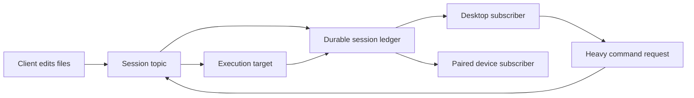

# Always-offload heavy commands and centralize session sync

## Context

The existing `command_execute` path recognizes a deliberately narrow heavy set—`lint`, `typecheck`, `test`, and `build`—but `OffloadCommandRouter.executeIfEligible` only hands those commands off when `makeResourcePressureMonitor().isSqueezed` reports low memory or sustained CPU pressure. Otherwise it falls through to local execution. The intended behavior is to keep the existing safety classifier but remove this resource-pressure gate so each actually requested heavy command always uses the configured cloud or owned-device target.

This remains request-driven: edits and sync events must never trigger build, lint, test, or typecheck automatically. The agent/operator decides when a check is needed.

The relay already centralizes each remote session in one `SessionTunnelObject`, keyed by `sessionId`, with passive attachment records and one controller lease. However, tunnel admission currently closes every existing socket for the same endpoint (`apps/device-relay/src/session-tunnel.ts:703-709`), so only one desktop actually receives events. Although `publishEnvelope` loops over all opposite-endpoint sockets (`apps/device-relay/src/session-tunnel.ts:845-907`), singleton admission prevents real fan-out. Acknowledgements are also endpoint-global, so multi-client replay needs an explicit subscriber policy.

Heavy-command input freshness is separate from relay fan-out. `workspace_edit` awaits the filesystem write, and `executeIfEligible` then calls `captureOffloadSnapshot(cwd)` for every command. The capture reads the current Git worktree twice and fails if it moves during capture. There is no background sync barrier to wait for, so no new edit revision/event protocol is needed for tracked files.

> [!IMPORTANT]
> Removing resource gating must not remove authentication, runtime-contract compatibility, controller fencing, command durability, or reconnect replay.

## Approach

1. Keep `parseObservedAgentShellCommand` and `classifyOffloadCommand` unchanged so only the existing safe `lint`, `typecheck`, `test`, and `build` presets (plus configured exact commands) qualify. In `OffloadCommandRouter.executeIfEligible`, remove the `isSqueezed` early return so every qualifying, actually requested command reaches the configured cloud or owned-device target.
2. Reuse the existing `SessionTunnelObject` as the session topic. Stop replacing same-endpoint desktop sockets so controller and passive observers can remain connected concurrently. `publishEnvelope` already iterates all opposite-endpoint sockets; keep `publishAuthorizedEnvelope` unchanged so only the active controller can mutate.
3. Keep acknowledgements session/endpoint-wide: the requirement is reliable broadcast to clients currently attached, not per-observer offline replay. A disconnected observer must not hold retention open; when it reconnects, it refreshes current session state through the existing desktop data path.
4. Keep file freshness on the existing per-command snapshot path: an edit completes, then the requested heavy command captures that exact worktree. Do not add timers, automatic checks, edit-triggered builds, or a second file-sync protocol.
5. Reuse the existing command ledger, encrypted tunnel, controller-generation fencing, and live persisted-event watcher. Extend the existing real Electron Offload Compute E2E, then launch the development server and app for an edit → immediate requested handoff proof.

## Files to modify

| Path | Planned change |
| --- | --- |
| `packages/cli-adapters/src/offload-command-router.ts` | Remove the resource-pressure early return so every qualifying requested command uses the configured offload target. |
| `packages/cli-adapters/src/offload-command-router.test.ts` | Replace headroom/local expectations with unconditional handoff coverage; keep fail-closed target tests. |
| `packages/cli-adapters/src/resource-pressure.ts` | Delete the now-unused CPU/memory sampler and `JINGLER_E2E_RESOURCE_PRESSURE` override. |
| `packages/cli-adapters/src/resource-pressure.test.ts` | Delete pressure-threshold tests with the removed policy. |
| `apps/device-relay/src/session-tunnel.ts` | Allow concurrent desktop subscribers while retaining singleton/replacement behavior for the device endpoint; keep the existing broadcast loop, endpoint-wide acknowledgements, and controller-gated publishing. |
| `apps/device-relay/src/session-tunnel.test.ts` | Prove controller + passive observer realtime delivery, shared acknowledgement pruning, disconnect behavior, and passive mutation rejection. |
| `apps/desktop/e2e/offload-compute.spec.ts` | Extend the existing bundled-device-agent scenario to prove enabled heavy work offloads without pressure and sees an immediately preceding tracked-file edit. |

## Reuse

- `parseObservedAgentShellCommand` and `classifyOffloadCommand` in `packages/core/src/offload-compute.ts` for the existing safe heavy-command set and exact configured commands.
- `registerWorkspaceMutationTools` in `packages/cli-adapters/src/runtime/tools/workspace-mutation-tools.ts` for the existing `command_execute` offload-then-local flow.
- `captureOffloadSnapshot` in `packages/cli-adapters/src/offload-snapshot.ts` for a fresh, moving-worktree-safe snapshot on every requested handoff.
- `SessionCommandHandler` and `SessionCommandHandler.watchPersisted` in `apps/device-agent/src/session-handler.ts` for durable admission, exactly-once execution, live updates, replay, and acknowledgement pruning.
- `runDeviceSessionTunnel` in `apps/device-agent/src/session-tunnel.ts` for encrypted session-scoped command/event transport.
- `SessionTunnelObject`, `attachClient`, `acquireController`, `publishEnvelope`, and `publishAuthorizedEnvelope` in `apps/device-relay/src/session-tunnel.ts` for the existing session topic, attachment identity, broadcast loop, and single-writer safety.

## Steps

- [x] Trace the desktop classifier/selector, relay topic implementation, snapshot path, executor operations, and every caller of the resource check.
- [x] Define the exact supported heavy-command set and session subscriber semantics from code plus operator decisions.
- [ ] Remove the resource-pressure veto while retaining classification safety, online, authorization, and runtime compatibility checks; delete the sampler if it becomes dead code.
- [x] Remove same-endpoint socket replacement for desktop subscribers only; keep one device socket, session-wide acknowledgements, current bounded replay, and the existing encrypted envelope contract.
- [x] Add focused tests for unconditional dispatch, fresh edited bytes, multi-subscriber delivery, shared acknowledgement pruning, disconnect behavior, and stale-controller safety.
- [x] Extend `apps/desktop/e2e/offload-compute.spec.ts` using its existing owned-device fixture and bundled device agent; do not add another fixture layer.
- [ ] Run focused package tests, root lint/typecheck/tests, the focused Electron E2E, then start the server and Electron app for a manual edit → handoff proof.

## Verification

- Unit/integration: an actually requested command in the existing heavy set always chooses the configured execution target regardless of desktop CPU/memory state; unknown, interactive, stateful, shell-composed, or secret-bearing commands remain local.
- Sync: a controller and passive observer attached to one `sessionId` receive the same ordered device event in realtime; the passive observer still receives `stale-controller` if it tries to publish a command.
- Replay: the active session stream retains current bounded reconnect replay and endpoint-wide cumulative acknowledgement behavior; disconnected observers refresh current session state instead of retaining private replay cursors.
- Freshness: after a tracked-file edit resolves, immediate snapshot capture contains the new bytes; a concurrent moving worktree fails instead of running stale input.
- Safety: offline, unauthorized, incompatible, and stale-controller targets still fail explicitly; duplicate commands do not execute twice.
- Commands: run the focused package tests first, then `pnpm lint`, `pnpm typecheck`, and `pnpm test`.
- Real app automation: extend the owned-device case in `apps/desktop/e2e/offload-compute.spec.ts`; launch with no pressure override, edit a tracked fixture file, immediately request an eligible command, and assert `FakeDeviceRelay.commandAdmissions` plus the UI result prove bundled-device execution saw the edit.
- Real app manual: start prerequisites and `pnpm dev`, open Electron, attach a local/paired target, edit a tracked file, invoke build or lint immediately, and capture logs/UI evidence showing remote execution used the new contents.
