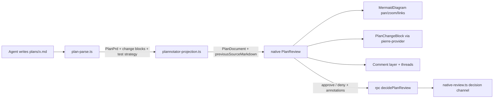

## Context
Plan review currently runs the upstream Plannotator frontend: `packages/plannotator-ext/assets/plan-review-v0.27.8.html`, an 18k-line minified build. It's mounted in a `WebContentsView` over a `jingler-plan://` protocol (`apps/desktop/src/main/plannotator-view.ts`, 587 lines). We patch it by string-matching minified symbols (`let Wbe=TTt;`) and stub about 45 upstream `/api/*` endpoints we don't use (AI, Obsidian, share, paste, goal-setup, editor annotations). We can't extend it without vendoring upstream's bun/vite app.

We want every plan to show:
- interactive architecture and flow diagrams,
- proposed code as `@pierre/diffs` diffs, each linked to its file,
- proposed test cases plus an overall test strategy.

Operator decisions (2026-09-26):
- Review UI becomes **native React in `packages/ui`**. Delete the HTML bundle and the embed plumbing. This reverses the "keep the embedded view" call in `plans/settled-sessions-structured-plans.md`.
- Proposed code is written as **fenced `diff path=<repo path>` blocks** (unified diff).
- Diagrams stay **Mermaid**, plus pan/zoom, fullscreen, and nodes that link to a stage or file. No React Flow.
- Keep from upstream: **inline text annotations** and **revision diff**. Cut: draft autosave, grid/look toggles, and everything else in the bundle.

The pi extension (`plannotator_submit_plan`, the native review over the event bus in `native-review.ts`, `[DONE:n]` progress) stays. Only the review surface and the plan format change.

## Approach
The data model already has most of this. `PlanDocument`/`PlanPrd` in `packages/core/src/plan-document.ts` carry typed blocks, stage diagrams, anchored `PlanAnnotation` threads, call-path diffs, and acceptance test references. The review decision already has a native RPC route (`apps/desktop/src/main/rpc.ts:5436` → `runtime.decidePlanReview`). The native review UI that #260 deleted still exists in git at `58a521e9^`: `plan-doc/plan-comment-layer.tsx`, `plan-comment-thread.tsx`, `plan-steps/plan-step-card.tsx`, `plan-walkthrough.tsx`, `plan-minimap.tsx`. Restore those selectively and don't rewrite them. Leave `plan-flow.tsx`/`plan-architecture.tsx` out, because they need React Flow.

Estimate: about 2.5 days total (per-stage estimates below).

## Files to modify
Stage Files sections have the full list. Main areas:
- `packages/core/src/plan-document.ts`, `packages/plannotator-ext/plan-parse.ts`, `packages/core/src/plannotator-projection.ts`: new block and field types
- `packages/ui/src/screens/plan-review.tsx` plus restored `packages/ui/src/composites/plan-*`: the native screen
- `apps/desktop/src/main/plannotator-view.ts`, preload, `electron-builder.yml`, `packages/plannotator-ext/assets/*`: deleted
- `packages/plannotator-ext/plannotator.json`, `skills/plannotator/SKILL.md`: authoring rules

## Reuse
- `MermaidDiagram` (`packages/ui/src/components/mermaid-diagram.tsx`): lazy load, theme tokens, `securityLevel: "strict"`.
- The `@pierre/diffs` 1.5.1 stack in `packages/ui/src/diff/` (`pierre-provider.tsx`, `pierre-model.ts`, `parse.ts`, `pierre-annotations.tsx`). Render proposals through it; don't add a second diff renderer. Per the Pierre React recipe, `MultiFileDiff` takes old/new contents, and a patch goes through the existing `parse.ts` path (https://diffs.com/docs, https://github.com/pierrecomputer/pierre/blob/main/skills/diffs/references/recipe-react.md).
- `FileChangeList` / diff-panel "open file" actions for file links.
- `planBlockText` and `PlanAnnotationAnchor` for comment anchors.
- `native-review.ts` decision channel and `rpc.ts` `decidePlanReview`.
- Deleted native UI at `58a521e9^` (see Approach).

## Parse proposed diffs and test strategy into the plan model <!-- id: plan-blocks -->
Plans carry proposed code changes and a test strategy as typed data, not loose markdown.

### Approach
- Widen `FENCE_LINE` in `plan-parse.ts` to accept an info string (`diff path=src/a.ts`). Today non-mermaid stage fences are dropped (`plan-parse.ts:395`); keep them as blocks.
- Add a `PlanChangeBlock { kind: "change", id, path, patch }` to the `PlanBlock` union. It's valid in stage `notes`/`walkthrough` and in document sections.
- Add optional `kind: "unit" | "integration" | "e2e" | "manual"` to `PlanTestReference` (the tag sits on the reference), parsed from `(test[unit]: path::case)`. Plain `(test: …)` stays valid.
- A top-level `## Test strategy` section is parsed as an ordinary document section. Nothing new is needed there beyond requiring it in validation.
- `plan-validation.ts`: a `diff` fence without `path=`, or with an absolute or `..` path, is a stage-specific diagnostic. New structured plans also need a `Test strategy` section. Legacy plans skip both checks.

### Technical explanation
Keep diffs as raw unified patch text in the DTO. The renderer already parses patches into `FileDiffMetadata` (`packages/ui/src/diff/parse.ts`), so the core package doesn't take a `@pierre/diffs` dependency. Path validation matters because the path turns into a clickable file link.

- [x] Add `PlanChangeBlock` and test-reference `kind` to core schemas, with backward-compatible decoding
- [x] Parse `diff path=` fences and `test[kind]:` references in `plan-parse.ts`
- [x] Add validation diagnostics for bad change paths and a missing test strategy on new plans

### Acceptance
- [x] A stage with two `diff path=` fences projects two change blocks with exact patch text, and checkbox numbering is unchanged (test[unit]: packages/plannotator-ext/plan-parse.test.ts::parses diff path fences into change blocks)
- [x] `test[e2e]:` sets the reference kind, and legacy `test:` still decodes (test[unit]: packages/plannotator-ext/plan-parse.test.ts::parses typed test references and keeps untyped ones valid)
- [x] Absolute/`..` paths and a missing Test strategy are rejected on new plans but not on legacy ones (test[unit]: packages/plannotator-ext/plan-validation.test.ts::rejects unsafe change paths and missing test strategy)
- [x] Change blocks and typed references project into a decodable `PlanDocument`; legacy payloads still decode (test[unit]: packages/core/src/plannotator-projection.test.ts::projects proposed changes and typed test references into a valid PlanDocument, decodes a legacy flat payload without the structured fields)

### Files
- `packages/core/src/plan-document.ts` — M
- `packages/core/src/plannotator-projection.ts` — M
- `packages/core/src/plannotator-projection.test.ts` — M
- `packages/plannotator-ext/plan-parse.ts` — M
- `packages/plannotator-ext/plan-parse.test.ts` — M
- `packages/plannotator-ext/plan-validation.ts` — M
- `packages/plannotator-ext/plan-validation.test.ts` — M

> complexity: medium (about 4h)

## Replace the embedded bundle with a native review screen <!-- id: native-review -->
Reviewers read, annotate, approve, and deny plans in a native screen that renders diagrams, diffs, and tests.

### Approach
- Restore `plan-doc/plan-comment-layer.tsx`, `plan-comment-thread.tsx`, and `plan-steps/plan-step-card.tsx` (+ tests) from `58a521e9^`, then adapt them to the current `PlanDocument`.
- Rewrite `PlanReview` to render document sections, stages (intent, approach, tasks, walkthrough, change blocks, diagrams, acceptance), and an approve/deny bar. Keep its props (`onApprove`, `onRevise(feedback)`). Drop `host.openPlannotator`/bounds polling.
- `PlanChangeBlock` renders through `pierre-provider`. The header shows the path as a link that opens the file in the existing file/diff panel.
- Acceptance renders as a table (kind · criterion · test path::case) under each stage. Document-level Test strategy renders as prose above it.
- On deny, serialize open annotations as quoted-anchor + comment into `feedback`, the same shape upstream sends.
- Delete `plannotator-view.ts` (+ test), preload `PLANNOTATOR_*` channels, the `index.ts` install, the `electron-builder.yml` asset copy, `assets/plan-review-v0.27.8.html`, `jingler-embed.patch`, `PROVENANCE.json`, `PLANNOTATOR-LICENSE-MIT`, unused `generated/html-assets.ts` and `favicon.ts`, and the matching `THIRD-PARTY-LICENSES` entry. Update `NOTICE.md`.

### Technical explanation
The embed needs a second Electron session partition, a custom protocol, a bounds-sync rAF loop, and string patches against minified code that break on any rebuild. Native rendering removes all of that and puts plans on the same theme, diff, and Mermaid components as the rest of the app. The decision path doesn't change: `rpc.ts` `decidePlanReview` → `native-review.ts` decision channel. Stale-proposal detection (a patch that no longer applies to HEAD) is **skipped**. Add it when agents start producing diffs that drift during review.

- [x] Selection comments as local drafts (deviation: the persisted-thread layer at `58a521e9^` was built for replies/mentions/delivery state; review comments only ship in deny feedback, so a small draft list replaced ~700 restored lines)
- [x] Rewrite `PlanReview` natively, including change blocks and the acceptance table
- [x] Route approve/deny with serialized annotations through the existing RPC
- [x] Delete the embed view, protocol, preload channels, and packaged assets; update NOTICE (deviation: `generated/html-assets.ts`/`favicon.ts` are still imported and the THIRD-PARTY-LICENSES entry still covers the forked extension, so both stay)

### Acceptance
- [x] Renders sections, stages, change blocks (with file link), diagrams, and the acceptance table from a fixture plan (test[unit]: packages/ui/src/screens/plan-review.test.tsx::renders stages with diffs diagrams and tests)
- [x] Deny sends feedback containing each open annotation's quoted anchor and body. Approve calls `onApprove` once (test[unit]: packages/ui/src/screens/plan-review.test.tsx::serializes annotations into deny feedback)
- [x] Submit → deny → resubmit → approve works end to end with no `WebContentsView` (test[e2e]: apps/desktop/e2e/plan-mode.spec.ts::revises one stage approach through native review feedback)
- [x] The packaged app contains no `plannotator/` asset directory (test[integration]: scripts/artifacts/check-packaged-artifacts.mjs)

### Files
- `packages/ui/src/screens/plan-review.tsx` — M
- `packages/ui/src/screens/plan-review.test.tsx` — M
- `packages/ui/src/composites/plan-doc/plan-comment-layer.tsx` — A (restored)
- `packages/ui/src/composites/plan-doc/plan-comment-thread.tsx` — A (restored)
- `packages/ui/src/composites/plan-steps/plan-step-card.tsx` — A (restored)
- `packages/ui/src/composites/plan-change-block.tsx` — A
- `apps/desktop/src/main/plannotator-view.ts`, `plannotator-view.test.ts` — D
- `apps/desktop/src/main/index.ts`, `apps/desktop/src/preload/index.ts`, `apps/desktop/electron-builder.yml` — M
- `packages/plannotator-ext/assets/*`, `generated/html-assets.ts`, `generated/favicon.ts` — D
- `packages/plannotator-ext/NOTICE.md`, `THIRD-PARTY-LICENSES` — M
- `apps/desktop/e2e/plan-mode.spec.ts`, `apps/desktop/src/main/e2e/pi-fixture.ts` — M

> complexity: high (about 1.5 days)
> depends: plan-blocks

## Make diagrams interactive <!-- id: interactive-diagrams -->
Architecture and flow diagrams can be panned, zoomed, opened fullscreen, and clicked through to the stage or file they describe.

### Approach
- Add pan/zoom (wheel + drag, reset) and a fullscreen dialog to `MermaidDiagram` using CSS transforms on the rendered SVG. No new dependency.
- Links come from our own comment directive, `%% link <nodeId> file:src/a.ts` or `%% link <nodeId> stage:<id>`, which we parse and attach to the rendered node `<g id>` after rendering.
- Unknown node IDs and unsafe paths are ignored.

### Technical explanation
Mermaid's native `click` callbacks need `securityLevel: "loose"`, which allows script in agent-written content. Keep `strict` and do the linking ourselves, so plan text can never run code. Mermaid treats `%%` lines as comments, so they don't affect rendering elsewhere.

- [x] Pan/zoom/reset and fullscreen in `MermaidDiagram`
- [x] Parse `%% link` directives and wire node clicks to stage scroll or file open (note: hand-drawn flowchart nodes carry no `data-id`, so nodes are matched by their `-flowchart-<id>-<n>` DOM id; the SVG is injected in the wiring effect so React re-renders can't drop the handlers)

### Acceptance
- [x] Link directives map node IDs to stage/file targets. Unsafe or unknown targets are dropped (test[unit]: packages/ui/src/components/mermaid-diagram.test.tsx::parses safe link directives)
- [x] Clicking a linked node in review scrolls to the stage or opens the file (test[e2e]: apps/desktop/e2e/plan-mode.spec.ts::diagram node opens linked stage)

### Files
- `packages/ui/src/components/mermaid-diagram.tsx` — M
- `packages/ui/src/components/mermaid-diagram.test.tsx` — A

> complexity: medium (about 3h)
> depends: native-review

## Show what changed between revisions <!-- id: revision-diff -->
After a deny/resubmit, the reviewer can see exactly what the agent changed.

### Approach
- The projection keeps the previous revision's `sourceMarkdown` as an optional `previousSourceMarkdown` on `PlanDocument`.
- `PlanReview` gets a "Changes since rev N-1" toggle that renders the markdown diff through `pierre-provider` using old/new contents.

### Technical explanation
`PlanDocument` already carries `revision` and `sourceMarkdown`. Keeping one previous copy is enough for the reviewer's question ("what did you change?"). Full version history is **skipped**. Add it if people ask to compare non-adjacent revisions.

- [x] Carry `previousSourceMarkdown` through projection on resubmission (the extension snapshots the reviewed text per plan path when each review starts and publishes it as `previousPlanContent` only when it differs)
- [x] Add the revision-diff toggle to `PlanReview`

### Acceptance
- [x] Resubmitting the same plan file sets `previousSourceMarkdown` to the prior revision's source. The first submission leaves it unset (test[unit]: packages/core/src/plannotator-projection.test.ts::keeps previous source on resubmission)
- [x] The toggle appears only when a previous revision exists and renders its diff (test[unit]: packages/ui/src/screens/plan-review.test.tsx::shows revision diff after resubmission)

### Files
- `packages/core/src/plan-document.ts` — M
- `packages/core/src/plannotator-projection.ts` — M
- `packages/ui/src/screens/plan-review.tsx` — M

> complexity: low (about 2h)
> depends: native-review

## Teach agents the new plan shape <!-- id: authoring-prompt -->
Planning agents reliably produce diagrams, proposed diffs, and a test strategy.

### Approach
- Update the planning instructions in `plannotator.json` and `skills/plannotator/SKILL.md`. Require an architecture or flow Mermaid diagram when the plan changes more than one module, with `%% link` directives. Require `diff path=` blocks for non-trivial proposed code. Require `## Test strategy`. Require `test[kind]:` references.
- Update the `plan-mode` e2e fixture plan to use every new element.

### Technical explanation
Validation from `plan-blocks` enforces the hard rules (safe paths, test strategy present). The prompt covers judgment calls, such as when a diagram is worth including. It doesn't force a diagram into every plan.

- [x] Update planning instructions and the skill
- [x] Update the e2e fixture plan to exercise every new block (diff, typed test, diagram with `%% link`, Test strategy — added in stages 1 and 3)

### Acceptance
- [x] The compiled planning prompt includes the diagram, diff, and test-strategy rules (test[unit]: packages/plannotator-ext/config.test.ts::planning instructions require diffs diagrams and test strategy)

### Files
- `packages/plannotator-ext/plannotator.json` — M
- `packages/plannotator-ext/skills/plannotator/SKILL.md` — M
- `packages/plannotator-ext/config.test.ts` — M
- `apps/desktop/src/main/e2e/pi-fixture.ts` — M

> complexity: low (about 1h)
> depends: plan-blocks

## Test strategy
- **Unit (vitest):** parsing, validation, projection decoding, link-directive parsing, and `PlanReview` rendering/serialization. These cover most of the logic because they sit on pure functions over `PlanPrd`.
- **Integration:** the packaged-artifact check proves the bundle is gone. Decision routing is already covered by `native-review.test.ts`; it gets no new tests because the channel doesn't change.
- **E2E (Playwright/Electron):** one extended `plan-mode.spec.ts` flow covers submit → annotate → deny → revision diff → approve, plus a diagram-link click. Extend the existing spec; don't add a parallel scenario.
- **Manual:** a visual pass in light and dark themes on a real agent-authored plan.

## Verification
- `pnpm vitest run packages/plannotator-ext packages/core packages/ui`
- `pnpm typecheck && pnpm lint`
- `pnpm --filter @jingler/desktop exec playwright test e2e/plan-mode.spec.ts`
- `pnpm artifacts:check`
